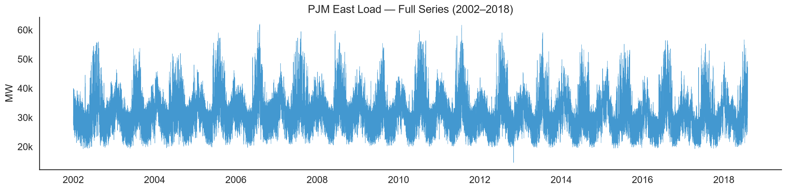
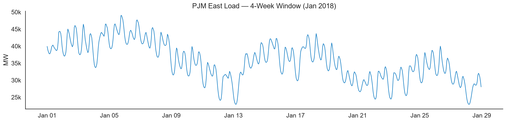
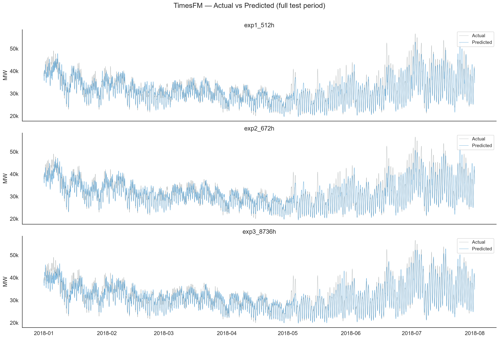
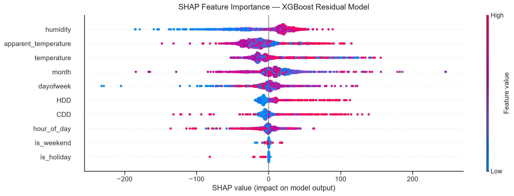
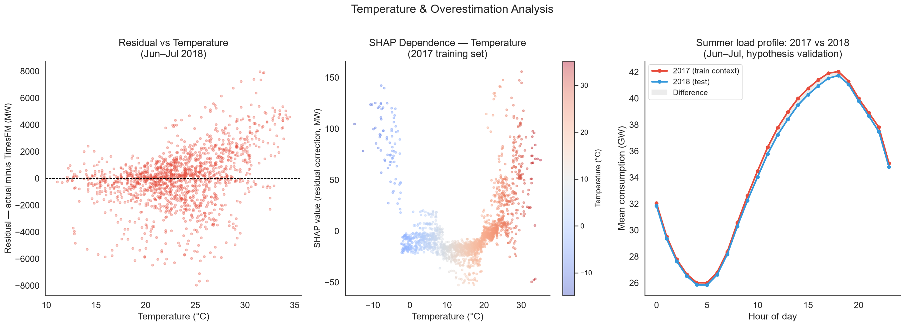
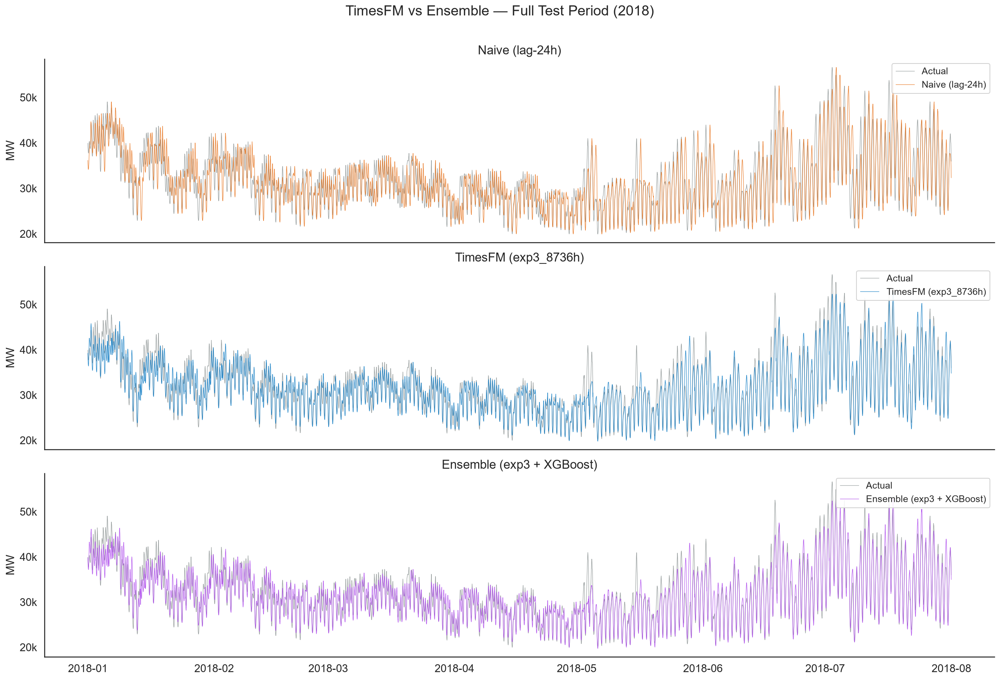
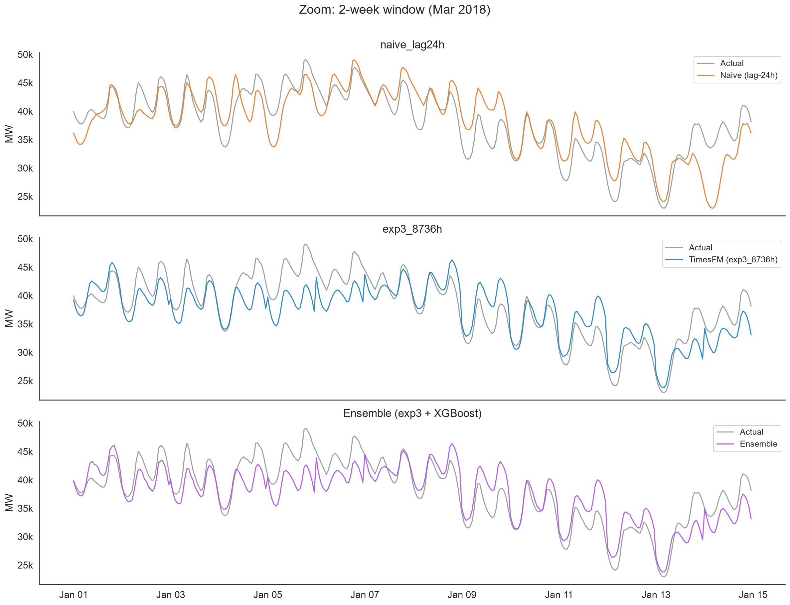

# Energy Demand Forecasting with TimesFM

Energy demand is one of the most studied time series problems in the world — yet predicting exactly how many megawatts a region will consume hour by hour remains genuinely hard. Temperature, day of week, holidays, extreme weather events: everything influences consumption in non-linear, interconnected ways.

This project uses data from the **PJM East** grid — 16 years of hourly demand (2002–2018) from the northeastern United States — as a laboratory to explore a practical question: **can a time series foundation model forecast energy demand with zero domain-specific training?**

The model under study is **TimesFM 2.5** (Google, 2024), a foundation model pre-trained on billions of time series points across diverse domains. Just as LLMs generate text without being trained for each specific task, TimesFM generates forecasts using only historical context — no fine-tuning required.

---

## The Data

16 years of hourly load data from PJM East. The series shows strong and regular cycles — daily peaks, weekly rhythms, and clear annual seasonality — which makes it a good benchmark for evaluating how well a model captures temporal structure across different scales.





---

## How Much Context Matters?

TimesFM processes input as fixed-size patches of 32 points. To avoid breaking cycles mid-patch, context length should be a multiple of the LCM of the patch size and the series' natural cycles. For PJM East (daily 24h + weekly 168h), LCM(32, 24, 168) = 672 — so 672h is the smallest context that closes all natural cycles without padding artifacts.

Three walk-forward experiments test this empirically over the first 7 months of 2018, evaluated against a naive lag-24h baseline:

| Experiment | Context | MAE | MAPE | Scaled MAE |
|---|---|---|---|---|
| naive_lag24h | — | 2,528 MW | 7.91% | 1.000 |
| exp1_512h | 512h (~3 weeks) | 1,594 MW | 4.74% | 0.630 |
| exp2_672h | 672h (~4 weeks, LCM-aligned) | 1,556 MW | 4.63% | 0.616 |
| exp3_8736h | 8,736h (1 year) | 1,466 MW | 4.44% | **0.580** |

The larger gain comes from annual context: a full year of history lets the model see that January 2018 should look like January 2017 — something 4 weeks of context cannot capture.



---

## What Does TimesFM Still Get Wrong?

The model is blind to weather. A residual study with XGBoost + SHAP reveals that the systematic error is concentrated on hot days — where TimesFM consistently underestimates actual consumption. On days above 25°C, the mean residual is **+1,331 MW**.

The three most important features by SHAP are all weather-derived: `humidity`, `apparent_temperature`, and `temperature`. Calendar features have marginal impact, confirming that TimesFM already handles temporal patterns well — the remaining error is climatic.





---

## Ensemble and Limits

Combining TimesFM with an XGBoost correction trained on the top 5 SHAP features (temperature, apparent_temperature, humidity, HDD, CDD) reduces the Scaled MAE from 0.580 to 0.562. The mean hot-day residual drops from +1,331 MW to +1,235 MW — a real but modest improvement.

| Model | MAE | MAPE | Scaled MAE |
|---|---|---|---|
| naive_lag24h | 2,528 MW | 7.91% | 1.000 |
| exp3_8736h | 1,466 MW | 4.44% | 0.580 |
| ensemble (exp3 + XGBoost) | 1,420 MW | 4.30% | **0.562** |

The bottleneck is not the foundation model — it is the volume of data available to train the correction in the extreme regimes where it matters most.





---

## Pipeline

```
01_eda.py              → Exploratory analysis of the PJM East series
02_data_cleaning,.py   → Cleaning: Sandy event, seasonal outliers, interpolation
03_walk_forward.py     → TimesFM inference (3 experiments) → walk_forward_results.csv
04_residual_model.py   → XGBoost on residuals + SHAP + temperature analysis
05_ensemble.py         → Final ensemble + comparative metrics and charts
```

---

## Methodological Note

The PJM East dataset is publicly available and widely used in the time series literature — there is a possibility that part of this data was included in TimesFM 2.5's pre-training corpus. For a rigorous scientific benchmark, this would be a relevant limitation. The goal of this project is educational: to explore model behavior, validate intuitions about input engineering, and demonstrate the ensemble-with-secondary-model technique. Results should be interpreted in that context.
