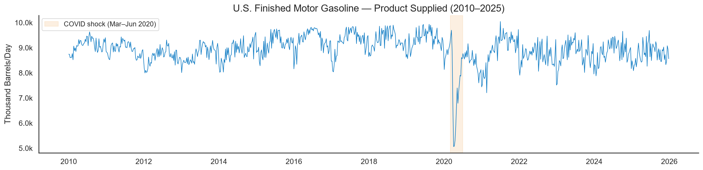
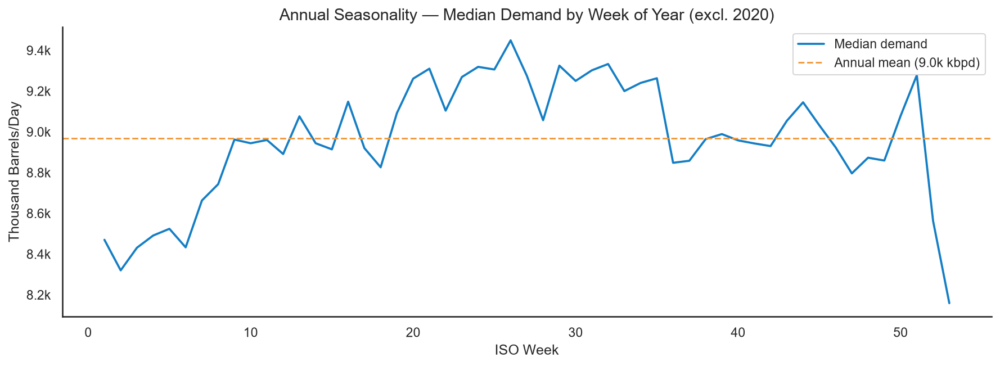
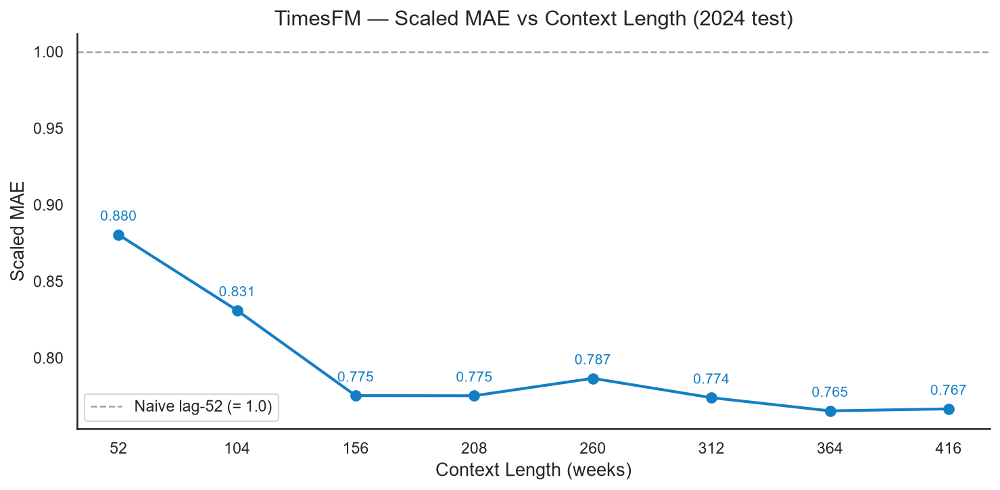
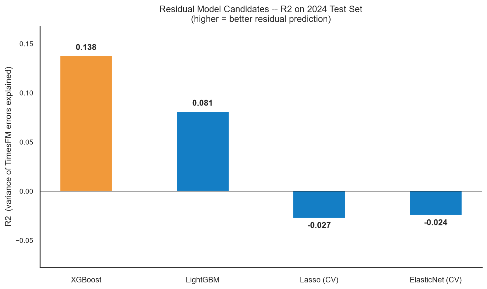
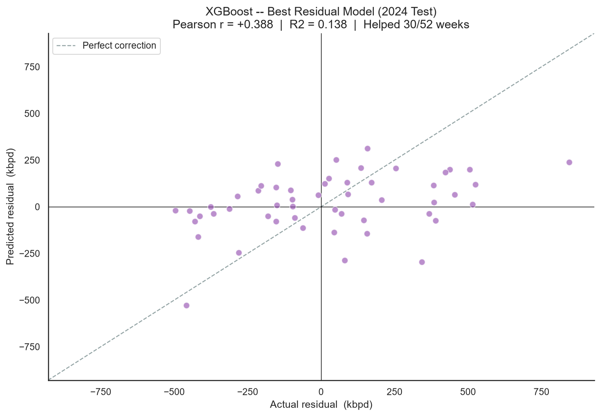
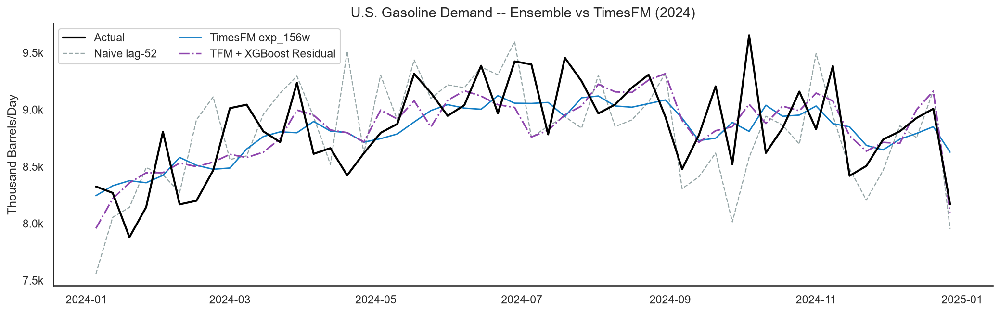
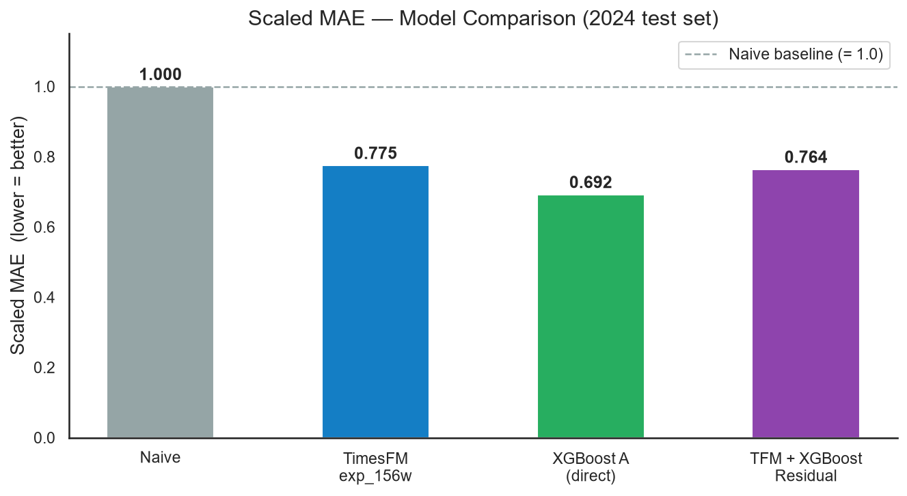
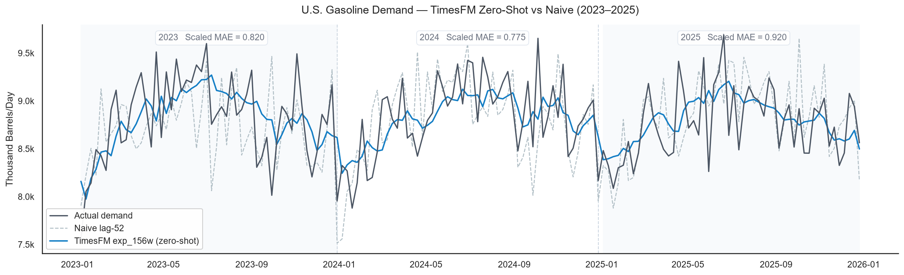

# U.S. Gasoline Demand Forecasting with TimesFM

Gasoline demand is noisier than energy demand — there is no strong daily cycle, no hour-by-hour regularity, and the weekly pattern is weak. This makes it a harder test for a zero-shot foundation model.

The question here is the same as Project 1: **can TimesFM 2.5 outperform a simple naive baseline without any fine-tuning on gasoline data?**

The dataset is **U.S. Finished Motor Gasoline Product Supplied**, published weekly by the EIA — 835 weeks from January 2010 through December 2025.

---

## The Data

The series shows a long-term plateau around 8,500–9,000 kbpd, a sharp drop during COVID-19 in 2020, and modest recovery after. Annual seasonality exists but is subtle — summer peaks are visible in a smoothed view, but week-to-week variation is high enough to obscure the pattern at the raw level.





---

## Context Length Selection

Unlike energy demand (which has clean 24h and 168h cycles), gasoline demand has no obvious patch-aligned cycle to choose from. A sweep from 52 to 416 weeks identifies the elbow empirically: Scaled MAE drops sharply from 52w to 156w, then stabilizes.

| Context | Scaled MAE |
|---|---|
| 52w  | 0.880 |
| 104w | 0.831 |
| **156w** | **0.775** ← selected |
| 208w | 0.775 |
| 260w | 0.787 |
| 312w | 0.774 |
| 364w | 0.765 |
| 416w | 0.767 |

156 weeks (~3 years) is chosen as the baseline context — it captures the first major gain and avoids GPU memory overhead of longer contexts.



---

## Residual Ensemble

After establishing the TimesFM baseline, the next question is whether a residual correction model can reduce the remaining error. Four candidates are evaluated on the 2014–2023 walk-forward residuals, with features spanning calendar, demand lags, rolling windows, and price:

| Model | R² (residual) |
|---|---|
| XGBoost | **0.138** ← selected |
| LightGBM | 0.081 |
| ElasticNet CV | −0.024 |
| Lasso CV | −0.027 |





XGBoost explains only 14% of the residual variance — the prediction is statistically better than random, but the signal is weak. Linear models fail entirely (negative R²), suggesting the relationship is non-linear and sparse. The ensemble is trained and evaluated on the 2024 test set:

| Model | MAE (kbpd) | MAPE | Scaled MAE |
|---|---|---|---|
| Naive lag-52 | 328.9 | 3.73% | 1.000 |
| TimesFM 156w | 255.0 | 2.88% | 0.775 |
| TFM + XGBoost residual | 241.8 | 2.73% | **0.735** |





The ensemble improves on TimesFM standalone, but the gain is modest — a direct consequence of the low R² on residuals.

---

## Zero-Shot Validation: 2023–2025

To assess consistency rather than a single test-year result, TimesFM is evaluated across three consecutive years — all zero-shot, no retraining.

| Year | Model | MAE (kbpd) | MAPE | Scaled MAE |
|---|---|---|---|---|
| 2023 | Naive lag-52 | 357.2 | 4.06% | 1.000 |
| 2023 | TimesFM 156w | 292.8 | 3.34% | **0.820** |
| 2024 | Naive lag-52 | 328.9 | 3.73% | 1.000 |
| 2024 | TimesFM 156w | 255.0 | 2.88% | **0.775** |
| 2025 | Naive lag-52 | 265.0 | 3.02% | 1.000 |
| 2025 | TimesFM 156w | 243.9 | 2.79% | **0.920** |

TimesFM beats the naive baseline in all three years without any adaptation to gasoline data.



---

## Conclusions

TimesFM 2.5 performs meaningfully better than a lag-52 naive baseline across three consecutive out-of-sample years (Scaled MAE 0.820 / 0.775 / 0.920 vs 1.000). For a zero-shot model — no fine-tuning, no domain-specific features — that is a useful result.

The harder finding is on the ensemble: the residual correction adds only marginal value (0.775 → 0.735) because TimesFM's errors on gasoline demand are largely unpredictable from available features. In Project 1 (energy demand), the residuals had a clear weather-driven structure that XGBoost could exploit. Here, the noise is more fundamental — driven by behavior and macro factors that a residual model cannot capture from lags and calendar features alone.

This makes gasoline demand a harder problem for the ensemble approach, and a better benchmark for assessing zero-shot performance in isolation.

---

## Pipeline

```
00_download.py         → EIA API → gasoline_weekly.csv
01_eda.py              → Full series + seasonality charts
02_baseline_models.py  → Context sweep (52–416w) + TimesFM 156w baseline → baseline_results_2024.csv
03_ensemble.py         → 4-model residual candidates → best_residual_model.joblib + ensemble_results_2024.csv
04_forecast_2025.py    → 3-year zero-shot validation (2023, 2024, 2025) → forecast_multiyear.png
```
